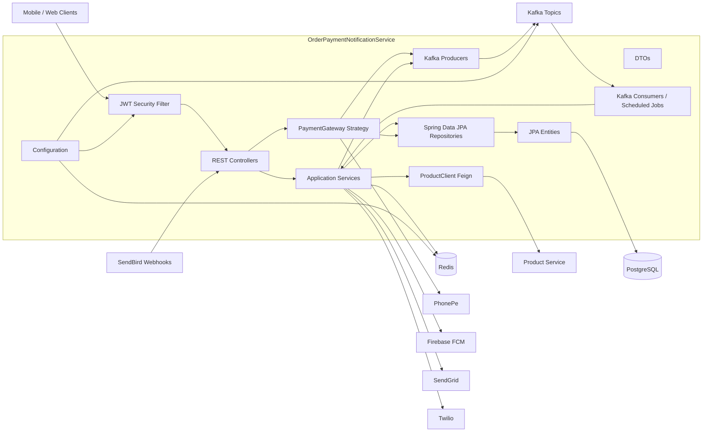
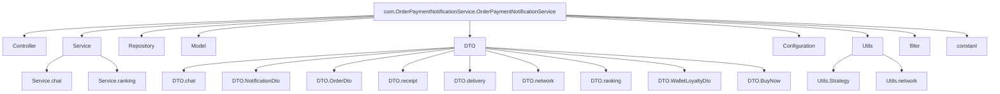
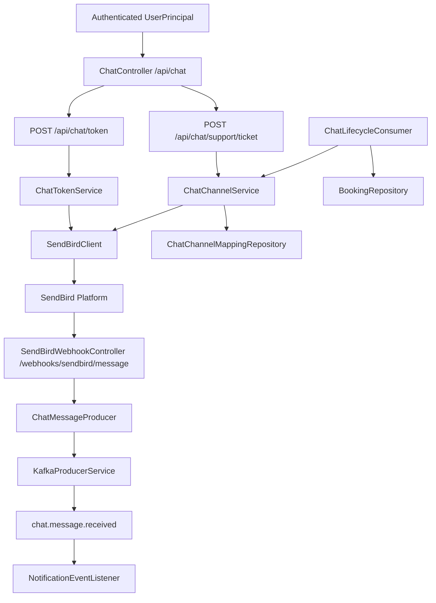
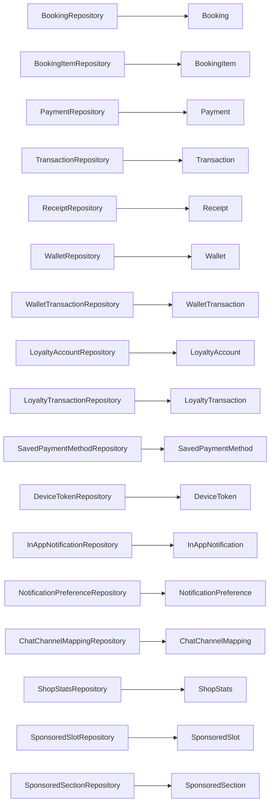
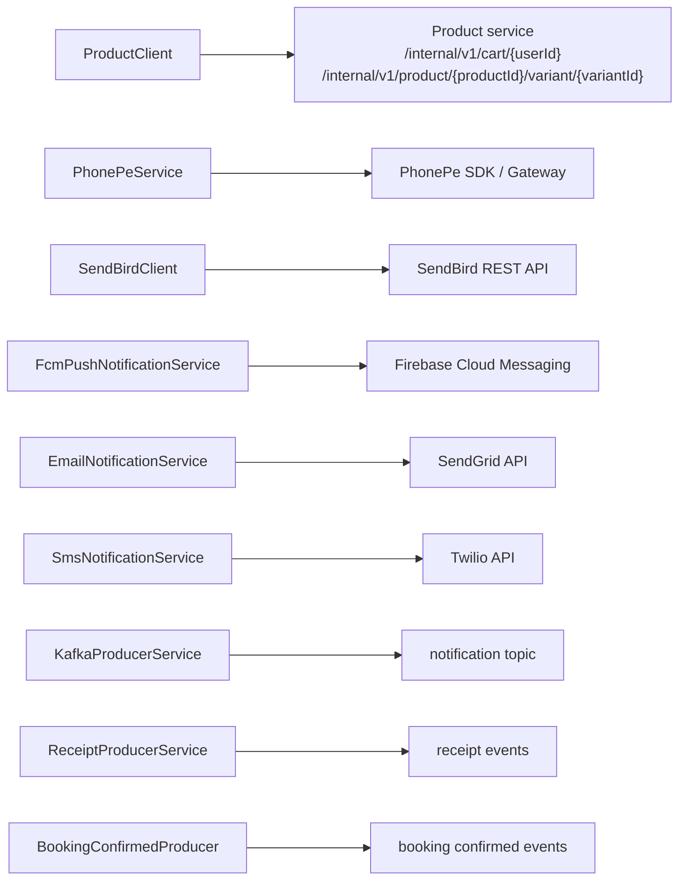

# OrderPaymentNotificationService Graph

Generated from `.` on 2026-05-03.

## High-Level Architecture

## Package Map

## Main Feature Flows

```mermaid
flowchart TD
    subgraph Booking
        BookingController --> BookingService
        BookingController --> BookingQueryService
        DirectPurchaseController --> DirectPurchaseService
        SellerBookingController --> SellerBookingService
        OrderTrackingController --> OrderTrackingService
        BookingService --> ProductClient
        DirectPurchaseService --> ProductClient
        BookingService --> BookingRepository
        BookingQueryService --> BookingRepository
        BookingQueryService --> PaymentRepository
        SellerBookingService --> BookingRepository
        SellerBookingService --> BookingItemRepository
        SellerBookingService --> PaymentRepository
        OrderTrackingService --> BookingRepository
        OrderTrackingService --> PaymentRepository
    end

    subgraph Payment
        PaymentController --> PaymentGatewayFactory
        PaymentController --> CodPaymentService
        PaymentController --> QrPaymentService
        PaymentGatewayFactory --> PhonePePaymentGateway
        PaymentGatewayFactory --> CodPaymentGateway
        PhonePePaymentGateway --> PhonePeService
        PhonePePaymentGateway --> ReceiptProducerService
        CodPaymentGateway --> ReceiptProducerService
        CodPaymentService --> TransactionRepository
        CodPaymentService --> PaymentRepository
        QrPaymentService --> TransactionRepository
        QrPaymentService --> PaymentRepository
    end

    subgraph WalletAndLoyalty
        WalletController --> WalletService
        LoyaltyController --> LoyaltyService
        PaymentMethodController --> SavedPaymentMethodService
        WalletService --> WalletRepository
        WalletService --> WalletTransactionRepository
        WalletService --> PaymentGatewayFactory
        LoyaltyService --> LoyaltyAccountRepository
        LoyaltyService --> LoyaltyTransactionRepository
        LoyaltyService --> WalletService
        SavedPaymentMethodService --> SavedPaymentMethodRepository
    end

    subgraph Notifications
        DeviceTokenController --> DeviceTokenService
        NotificationPreferenceController --> NotificationPreferenceService
        InAppNotificationController --> InAppNotificationService
        NotificationEventListener --> NotificationDispatcher
        NotificationDispatcher --> InAppNotificationService
        NotificationDispatcher --> FcmPushNotificationService
        NotificationDispatcher --> NotificationFactory
        NotificationFactory --> EmailNotificationService
        NotificationFactory --> SmsNotificationService
        FcmPushNotificationService --> DeviceTokenRepository
        InAppNotificationService --> InAppNotificationRepository
        NotificationPreferenceService --> NotificationPreferenceRepository
    end

    subgraph ReceiptAndRanking
        ReceiptController --> ReceiptService
        ReceiptProducerService --> Kafka
        ReceiptConsumerService --> ReceiptGeneratorService
        ReceiptConsumerService --> ReceiptRepository
        OrderEventListener --> ShopStatsRepository
        RankingService --> ShopStatsRepository
        RankingService --> ScoreCalculator
        RankingController --> Redis
    end

    subgraph Sponsorships
        SponsoredSlotController --> SponsoredSlotService
        SponsoredSectionController --> SponsoredSectionService
        SponsoredSlotService --> SponsoredSlotRepository
        SponsoredSectionService --> SponsoredSectionRepository
    end
```

## Chat / SendBird Flow

## Persistence Layer

## External Interfaces

