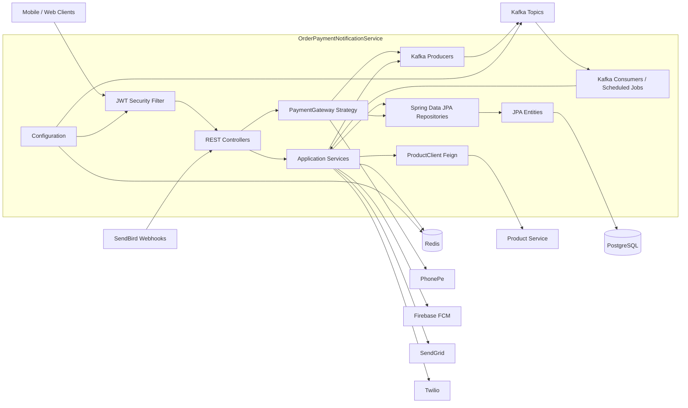

# Graphify Output

Generated from `.` on 2026-05-03.

## Files

- `architecture.mmd` - high-level service architecture
- `packages.mmd` - package and module layout
- `feature-flows.mmd` - main controller, service, repository flows
- `chat-sendbird.mmd` - chat token, support channel, webhook, and Kafka flow
- `persistence.mmd` - repository to entity map
- `external-interfaces.mmd` - external systems and integration points

## Preview

